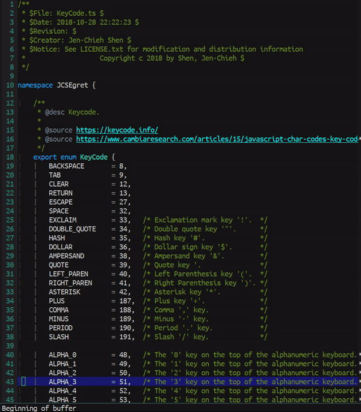
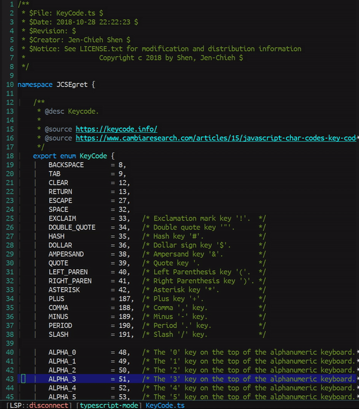

[](https://www.gnu.org/licenses/gpl-3.0)
[](https://melpa.org/#/better-scroll)
[](https://stable.melpa.org/#/better-scroll)

# better-scroll
> Improve user experience when scrolling window.

[](https://github.com/jcs-elpa/better-scroll/actions/workflows/test.yml)

Normally scroll up/down will move the cursor to the window boundary corresponding to
the direction on how the window scrolls. This package provides it's own scrolling
functions that will preserve cursor's position.

| Normal                       | With Better Scroll                  |
|:----------------------------:|:-----------------------------------:|
| | |

## 🔧 Usage

There are total 4 interactive functions in this package.

- `better-scroll-down`
- `better-scroll-up`
- `better-scroll-down-other-window`
- `better-scroll-up-other-window`

I will recommend to bind these function to global keys like the snippet below.

```el
(define-key global-map (kbd "<prior>") #better-scroll-down)
(define-key global-map (kbd "<next>") #better-scroll-up)

(define-key global-map (kbd "S-<prior>") #better-scroll-down-other-window)
(define-key global-map (kbd "S-<next>") #better-scroll-up-other-window)
```

*P.S. `<prior>` and `<next>` is corresponds to `page up` and `page down` key.*

### Aligment

You can set the cursor aligment by tweaking `better-scroll-align-type` variable.

```el
(setq better-scroll-align-type 'center)  ; 'center or 'relative
```

## 🛠️ Contribute

[](http://makeapullrequest.com)
[](https://github.com/bbatsov/emacs-lisp-style-guide)
[](https://www.paypal.me/jcs090218)
[](https://www.patreon.com/jcs090218)

If you would like to contribute to this project, you may either
clone and make pull requests to this repository. Or you can
clone the project and establish your own branch of this tool.
Any methods are welcome!

### 🔬 Development

To run the test locally, you will need the following tools:

- [Eask](https://emacs-eask.github.io/)
- [Make](https://www.gnu.org/software/make/) (optional)

Install all dependencies and development dependencies:

```sh
eask install-deps --dev
```

To test the package's installation:

```sh
eask package
eask install
```

To test compilation:

```sh
eask compile
```

**🪧 The following steps are optional, but we recommend you follow these lint results!**

The built-in `checkdoc` linter:

```sh
eask lint checkdoc
```

The standard `package` linter:

```sh
eask lint package
```

*📝 P.S. For more information, find the Eask manual at https://emacs-eask.github.io/.*

## ⚜️ License

This program is free software; you can redistribute it and/or modify
it under the terms of the GNU General Public License as published by
the Free Software Foundation, either version 3 of the License, or
(at your option) any later version.

This program is distributed in the hope that it will be useful,
but WITHOUT ANY WARRANTY; without even the implied warranty of
MERCHANTABILITY or FITNESS FOR A PARTICULAR PURPOSE.  See the
GNU General Public License for more details.

You should have received a copy of the GNU General Public License
along with this program.  If not, see <https://www.gnu.org/licenses/>.

See [`LICENSE`](./LICENSE.txt) for details.
